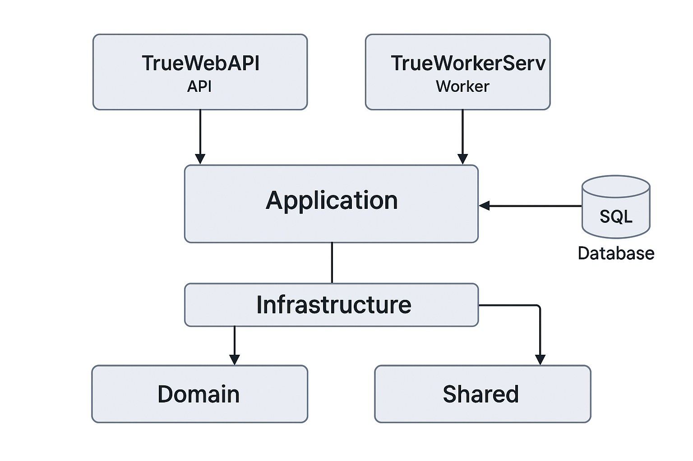
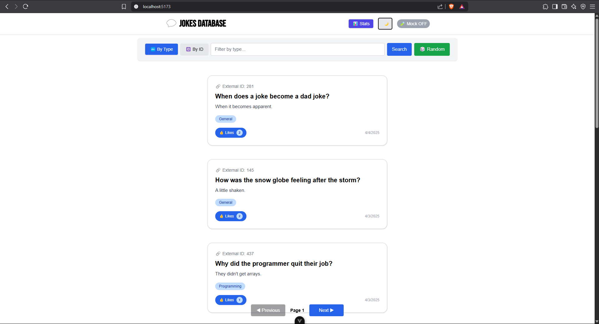
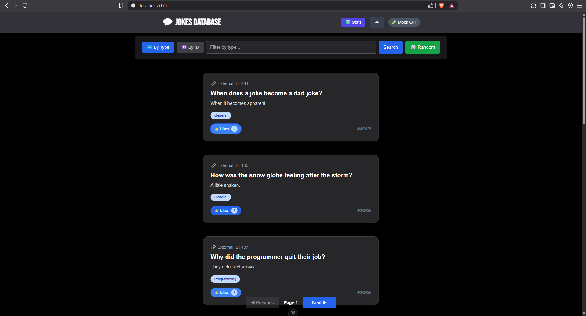
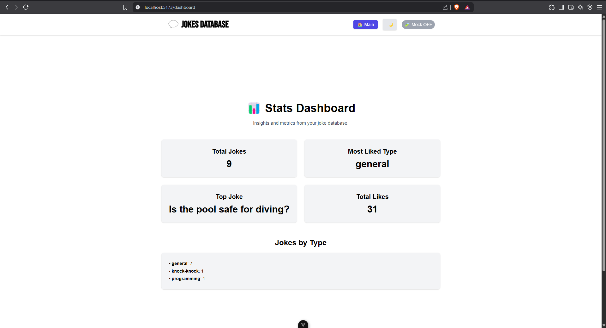
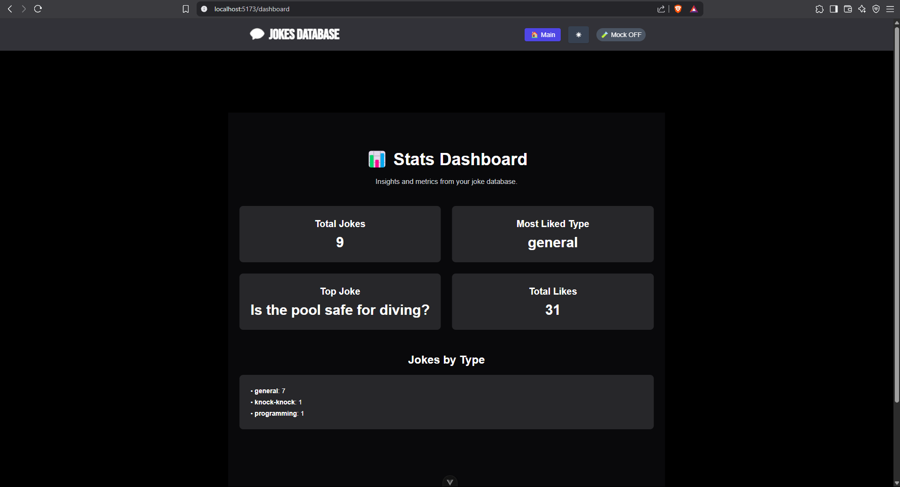

# Jokes Database

A complete full-stack application built with .NET 9, Clean Architecture, and Vue.js + TypeScript to manage and view a collection of jokes with upsert support, mock mode, and statistics.

---

## 📦 Functionality

This software fetches jokes from the [Official Joke API](https://official-joke-api.appspot.com/), stores them in a SQL Server database, and displays them through a Vue.js frontend. It supports:

- 🔍 Filterable and searchable joke listing.
- 🆔 Search jokes by external ID.
- ❤️ Like system persisted in the database.
- 🧪 Mock mode for testing without backend.
- 📊 Stats dashboard showing most liked, total jokes, grouped by type.
- 🎲 Random joke fetch from external API.
- 🔁 Hourly upsert job via Hangfire in a Worker Service.

---

## 🧱 Architecture

The project follows **Clean Architecture** with **Domain-Driven Design (DDD)** and **SOLID** principles. It's structured into:

### API

- ASP.NET Core Web API exposing endpoints for joke CRUD, statistics, and random external jokes.
- Swagger documentation and RESTful endpoints.

### Application

- Services handling use cases like upsert, filtering, statistics, and domain validation.

### Domain

- Entities such as `Joke`, containing core rules and behavior.

### Infrastructure

- EF Core implementation, MSSQL persistence, and external API integration.
- Repository pattern via interfaces and concrete classes.

### WorkerService

- Background job system using **Hangfire** to periodically fetch and upsert external jokes.

---

### 🗺️ Architecture Diagram



---

## 🖼️ UI Preview

| Light Mode | Dark Mode |
|------------|-----------|
|  |  |
|  |  |

---

## 🗃️ Database

- Uses **Entity Framework Core** with **MSSQL Server**.
- Includes a `Likes` field for each joke.
- Migration command used:

```bash
dotnet ef migrations add InitialCreate --project Infrastructure --startup-project TrueWebAPI
dotnet ef database update --project Infrastructure --startup-project TrueWebAPI
```

---

## 🖥️ Frontend

- Developed with **Vue.js 3** and **TypeScript**.
- Tailwind CSS for styling.
- Features:
  - Reusable `JokeCard` component.
  - Global dark mode toggle.
  - Mock Mode indicator.
  - Stats dashboard using real data or mock.
  - Responsive layout and animations.

---

## 🧪 Unit Tests

- Tests are implemented using **xUnit** and **Moq**.
- Located in the `Application.Tests` project.
- Covers:
  - `GetByExternalIdAsync`
  - `UpsertAsync`
  - `DeleteAsync`
- Run tests via:

```bash
dotnet test
```

---

## 🚀 Running Locally

### Backend

```bash
dotnet run --project TrueWebAPI
dotnet run --project WorkerService
```

### Frontend

```bash
cd WebAPIFrontEnd
npm install
npm run dev
```

Use `.env` to control the `VITE_USE_MOCK` value.

---

## ✅ Feature Checklist

| Feature                        | Status |
|-------------------------------|--------|
| Filter jokes by type          | ✅      |
| Search by external ID         | ✅      |
| Likes (saved to DB)           | ✅      |
| Dark mode                     | ✅      |
| Mock Mode                     | ✅      |
| Hourly upsert job (Hangfire)  | ✅      |
| Dashboard                     | ✅      |
| Unit tests (xUnit + Moq)      | ✅      |

---

## 📌 Notes

- No authentication was added to ease testing.
- CORS must be enabled in the backend to access API from frontend.
- Hosted entirely in one GitHub repository for simplicity.

---

## 👷 Author & Interview Context

This project was developed by **Lucas Pedrosa Larangeira** as part of a technical interview process. The goal was to build a full-stack system applying good architectural practices while demonstrating software design, testing, and clean UI implementation.
